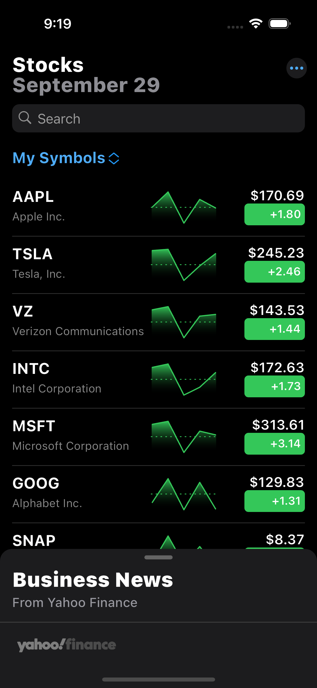

# Apple Stocks App Clone (Only UI)

This application is a clone of Apple's Stocks application, written in Flutter. The application contains static data and does not have remote API integration. The purpose of the application is solely to create a fluid native Apple-like experience and provide education to viewers throughout this process.

## 📸 ScreenShots

|| Real Apple Stocks App| This Clone App|
|-------|------|-------|
|General View|||
|
Snap According to Search Text
|||
|
Persistent DraggableBottom Sheet And extend Marquee
|||
|
Click any element on list and open detail sheet
|||

## App Animations

- Searchbar scroll and sliver.
- There are 2 DraggableScrollableSheet. One is persistent, other is depends on clicking any market on the list.
- After expanding DraggableScrollableSheet, Stock market prices marquee will be shown on AppBar.
- BottomNavigationBar has yahoo!finance logo as Apple does.
- Also BottomNavigationBar is persistent.

## Development Information

- Currently, This app' purpose is to educate viewers. So some unnecessary design details and Easily achievable UI patterns have been overlooked in app.
- If you have any question about this app, feel free to get in touch
- The app is exclusively available on Android devices.
- Contributions to the project are highly encouraged, including participation from UI/UX designers.

## Licensing

- This app is distributed under the GPL-3.0 License.
- See the [LICENSE](LICENSE.md) file for details.

## Connect with Me

- You can connect with me, If you have any specific inquiries or require further information.

[][linkedin]

